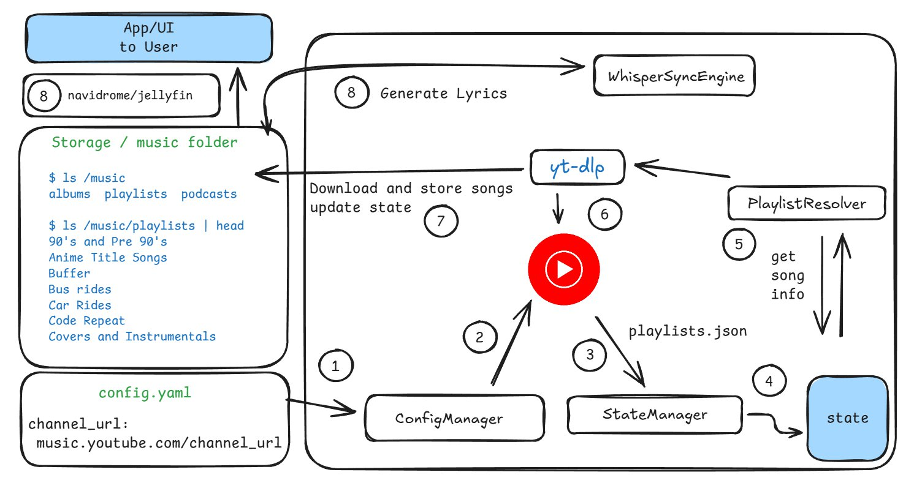

# youtube-music-sync
Script and docker that runs periodically and syncs youtube playlists with local folders, and edits the metadata of each song as required by your music client of choice.

## Features
1. Incremental playlist syncing
2. Crash-safe state tracking
3. No duplicate downloads
4. Playlist → Album metadata mapping
5. Works with Navidrome, Jellyfin, Plex
6. Optional Whisper-based lyrics generation
7. Docker support
8. Suitable for 24×7 operation on a NAS

# The Problem:
1. Music for me is a divine art form. So I dont like it when it is taken away from me. 
2. It is reasonable to like songs from small artists, and it is reasonable for them to have the right to remove it or make the video private. 
3. Most small artists or random background music from shows that a fan publishes on youtube are accessible only through youtube, and not spotify, so changing services is not the answer. 
4. There was a song I loved listening to everyday, and one day I opened my playlist and it was just gone. 
5. Any music provider you subscribe to can do this, or the uploader can, without notice, and you can't even blame them for it, as its their right. 
6. You cannot ditch using music services, as they are the primary source of new music.
7. Youtube does not allow you to just "Download" an MP3 file in full quality. Even youtube's own downloads is opaque. Same with any other service.
8. I want lyrics for my songs, to sing along (coz why not?), and downloading them one by one or using something like beets, (yes, I tried), was found unreliable and incomplete. (I would rather have bad lyrics than no lyrics)

# Solution

1. It is clear that there is a need to download the song as the MP3 file, so you must turn to youtube downloaders like yt-dlp.
2. Since I cannot ditch Youtube Music, And I still use it to explore and find new music, it would be cumbersome to run yt-dlp every few weeks or months. So there has to be a script that runs 24/7, that "monitors" your library. 
3. Since you cannot just download lyrics from Youtube Music or anywhere easily (automated, for all songs in your library, even the obscure ones), I found whisper to be quite reliable. 
4. To now listen to these songs, you can use any music server like navidrome, jellyfin etc.
5. You keep track of every song you downloaded so you do not download it again.

# How to use
1. Put your channel url in config.yaml. Further configs can be found in the `config.example.yaml` file. 

# Thanks to 
1. The kind developers and the community of yt-dlp.
2. claude.ai

## improvements
1. deletion of opus files is not happening consistantly
2. cover download is not consistant. we could try different ones. 
3. ui could be improved massively. 
4. completed playlists is not updated in state. 
5. fix error in ui click

> The app is still buggy at times, and lacks some features / or they are poorly implemented. Use at your own risk. Any help is much appreciated!